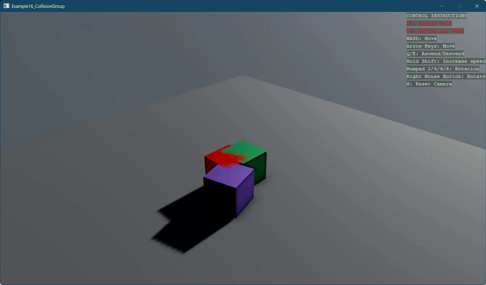

# Collision Group

This example demonstrates how to create a simple scene with two players and an enemy entity and set up collision groups to control which objects can collide with each other.

The `Program.cs` file shows how to:
- Define collision groups with specific IndexA values to control collision behaviors
- Create a 3D scene with colored cube entities representing players and an enemy
- Apply different collision group settings to each entity
- Demonstrate the rule where objects with IndexA value differences greater than 2 will collide

In this example, three collision groups are created:
- Two player collision groups (green and purple cubes) with IndexA values of 0 and 2
- One enemy collision group (red cube) with an IndexA value of 1

This configuration ensures that:
- The players will collide with each other because the difference between their IndexA values is 2
- The enemy entity won't collide with either player because the difference between their IndexA values is 1

[!INCLUDE [note-additional-packages](../../../includes/manual/examples/note-additional-packages.md)]

View on [GitHub](https://github.com/stride3d/stride-community-toolkit/tree/main/examples/code-only/Example16_CollisionGroup).

[!code-csharp]