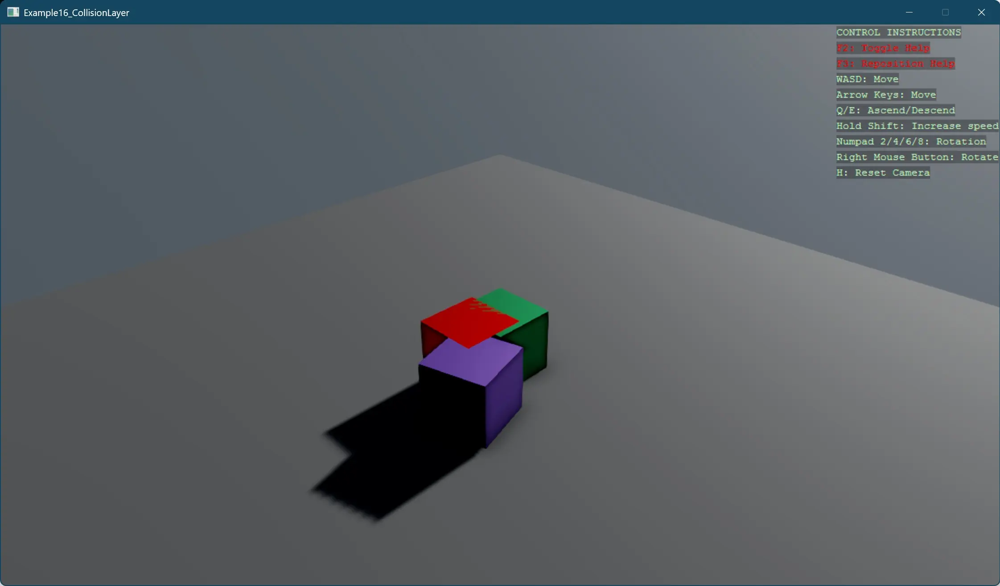

# Collision Layer

This example demonstrates how to implement and control collision detection between different types of entities using Stride's collision layer system. The code showcases:

- Creation and configuration of separate collision layers for players, enemies, and the ground
- Setting up a collision matrix to define interaction rules between different layers
- Implementation of selective collision detection where players can collide with each other and the ground, but not with enemies

The example creates a scene with two player cubes (green and purple) that can interact with each other and the ground, plus a red enemy cube that passes through players while still colliding with the ground. This pattern is useful for implementing gameplay mechanics like ghost modes, team-based collision, or phasing through specific obstacles.

[!INCLUDE [note-additional-packages](../../../includes/manual/examples/note-additional-packages.md)]

View on [GitHub](https://github.com/stride3d/stride-community-toolkit/tree/main/examples/code-only/Example16_CollisionLayer).

[!code-csharp]