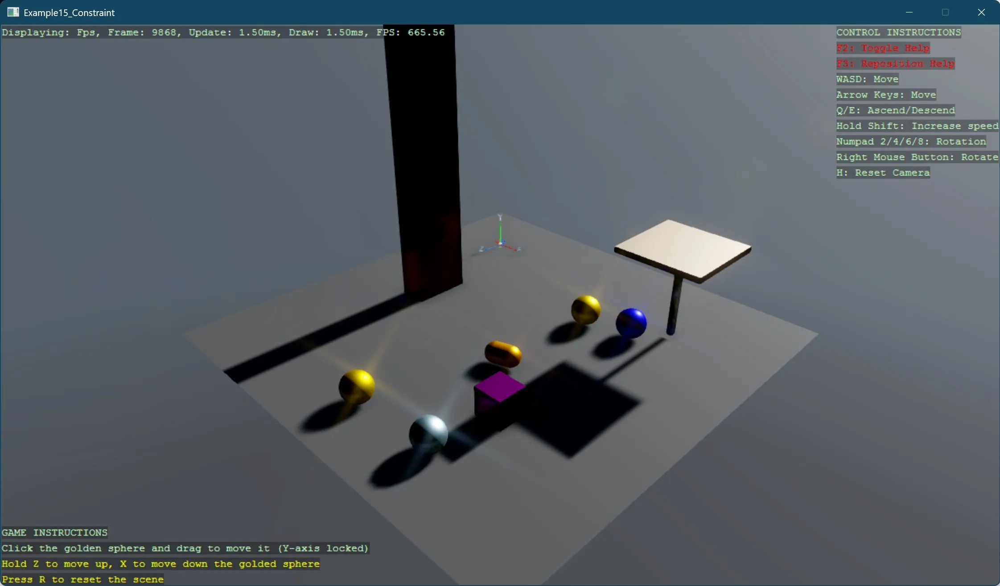

# Various constraints

This example demonstrates how to implement and use physics constraints in Stride using the BepuPhysics engine. The sample showcases four different constraint types:

- **DistanceLimit:** Connects two spheres with minimum and maximum distance limits, allowing them to move freely within that range but preventing them from getting too close or too far from each other
- **DistanceServo:** Links two spheres with a target distance and spring settings, actively pulling or pushing to maintain the specified separation
- **BallSocket:** Creates a pivoting joint between a static foundation and a platform, allowing rotation around a connection point similar to a ball-and-socket joint
- **PointOnLineServo:** Restricts cubes to slide along vertical lines while maintaining their orientation, creating two stacks of cubes that can only move up and down

The example features interactive elements where you can:
 
- Drag a golden sphere horizontally with the mouse while adjusting its vertical position using the Z and X keys
- Click on cubes in the vertical stacks to remove them, causing cubes above to fall
- Reset the entire scene by pressing R

This demonstrates how constraints can be used to create complex physical behaviors with controlled degrees of freedom. The example illustrates important physics concepts like servo constraints with spring settings, rigid body connections, and collision filtering between different object types.

[!INCLUDE [note-additional-packages](../../../includes/manual/examples/note-additional-packages.md)]

View on [GitHub](https://github.com/stride3d/stride-community-toolkit/tree/main/examples/code-only/Example15_Constraint).

[!code-csharp]