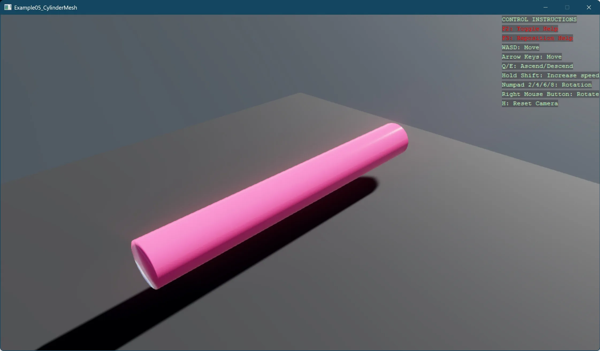

# Cylinder mesh

This example demonstrates creating a 3D cylinder mesh programmatically by breaking down the process into clear, distinct steps:
  
1. Setting up a basic 3D scene with a skybox
2. Creating precisely defined geometry using low-level mesh construction techniques
3. Demonstrating a structured approach to 3D mesh generation by dividing it into logical components:
   - Creating ring vertices
   - Building side walls
   - Adding end caps

We will be utilizing the @Stride.CommunityToolkit.Rendering.Utilities.MeshBuilder class from the toolkit, the process of crafting and rendering these geometries is streamlined.

For more details of `MeshBuilder`, refer to our [MeshBuilder manual](../../rendering/mesh-builder.md).

[!INCLUDE [note-additional-packages](../../../includes/manual/examples/note-additional-packages.md)]

View on [GitHub](https://github.com/stride3d/stride-community-toolkit/tree/main/examples/code-only/Example05_CylinderMesh).

[!code-csharp]
