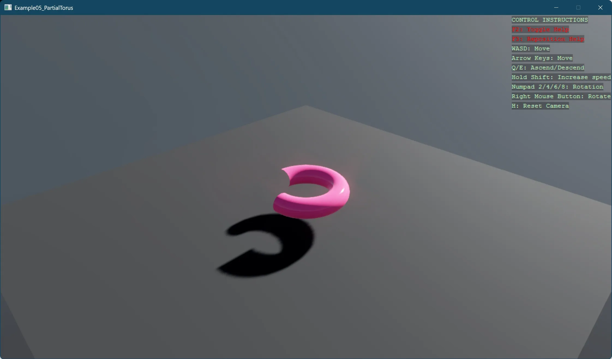

# Partial torus mesh

This example demonstrates creating a 3D partial torus mesh programmatically by breaking down
the process into clear, distinct steps:

1. Setting up a basic 3D scene with a skybox
2. Creating a parametrically defined torus geometry using mathematical formulas
3. Demonstrating how to generate a partial (incomplete) torus by constraining the bend angle
4. Building structured 3D mesh generation with proper vertex positioning and normal definitions

The example showcases important 3D graphics concepts including:
- Parametric surface generation using two angle parameters (circumference and bend)
- Correct normal calculation for accurate lighting and shading
- Triangle winding order for proper face orientation
- Vertex indexing to efficiently reuse vertices between adjacent triangles

For more details of `MeshBuilder`, refer to our [MeshBuilder manual](../../rendering/mesh-builder.md).

[!INCLUDE [back-culling](../../../includes/manual/examples/back-culling.md)]

[!INCLUDE [note-additional-packages](../../../includes/manual/examples/note-additional-packages.md)]

View on [GitHub](https://github.com/stride3d/stride-community-toolkit/tree/main/examples/code-only/Example05_PartialTorus_FSharp).

[!code-csharp]