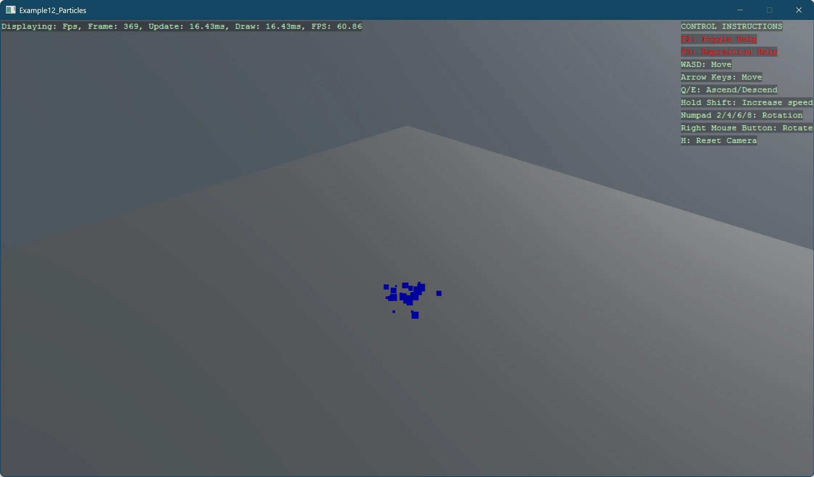

# Particles

This example demonstrates how to create and configure a particle system. The sample shows:

- Setting up a basic 3D scene with camera, lighting, and ground
- Creating a particle emitter with blue colored particles
- Configuring particle properties including lifetime, size, and spawn rate
- Setting up particle initializers for random starting positions and velocities
- Adding gravity to affect particle movement over time
- Using billboard shapes for rendering particles

The particles are spawned at a rate of 50 per second from a small area and shoot upward before gravity pulls them back down, creating a fountain-like effect. The particles have varying sizes between 0.1 and 0.5 units, with a blue color.

This example demonstrates fundamental concepts of particle systems in Stride, showing how to create dynamic visual effects through code.

[!INCLUDE [note-additional-packages](../../../includes/manual/examples/note-additional-packages.md)]

View on [GitHub](https://github.com/stride3d/stride-community-toolkit/tree/main/examples/code-only/Example12_Particles).

[!code-csharp]