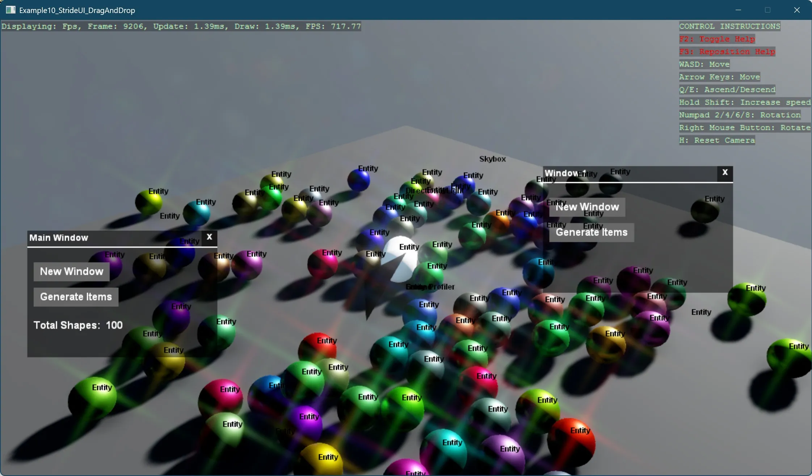

# Stride UI - Draggable Window

This example demonstrates how to create interactive, draggable UI windows in Stride using custom UI components. The project showcases:

- Creating a draggable window system using Stride's built-in UI framework
- Implementing window management with proper z-index handling (windows coming to front when clicked)
- Building a UI manager that handles window creation and management
- Dynamically spawning 3D objects from UI interactions
- Tracking object counts and updating UI elements accordingly

The code sets up a basic 3D scene with a draggable UI window containing buttons to:

1. Create additional draggable windows
2. Generate random 3D sphere objects that fall with physics

Each window includes a title bar, divider line, close button, and maintains proper stacking order when interacted with. The main window also displays a counter showing the total number of 3D shapes in the scene.

This example implements the functionality through several key classes:
- `UIManager` - Creates and manages UI windows, handles text updates
- `DragAndDropContainer` - Root canvas that tracks and manages draggable elements
- `DragAndDropCanvas` - Individual window implementation with title and interactive features
- `PrimitiveGenerator` - Creates and tracks 3D objects generated through UI actions

The project also includes cleanup functionality to remove objects that fall below a threshold, updating the counter accordingly. This demonstrates a complete UI workflow from user interaction to scene manipulation.

[!INCLUDE [note-additional-packages](../../../includes/manual/examples/note-additional-packages.md)]

View on [GitHub](https://github.com/stride3d/stride-community-toolkit/tree/main/examples/code-only/Example10_StrideUI_DragAndDrop).

[!code-csharp]